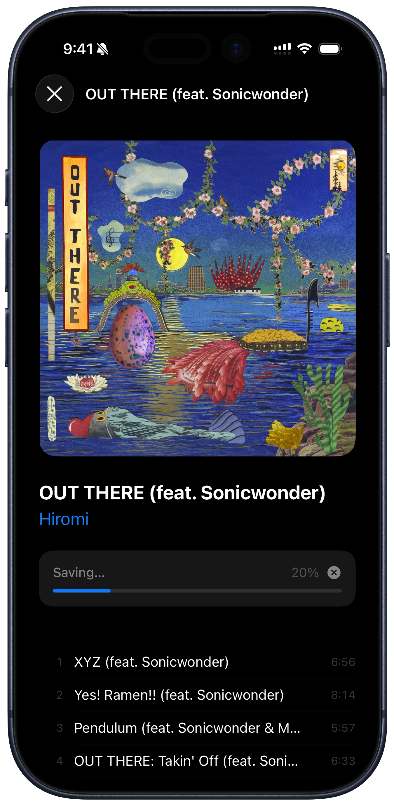

# Ambience

Ambience is a Swift package for Apple Music animated artwork (ambient video).

## Features
- Fetch animated artwork from Apple Music links.
- Play artwork in SwiftUI, UIKit, and AppKit.
- Cache assets for smoother playback.
- Companion app for browsing, previewing, and exporting ambient artwork.

## Requirements
- iOS 15+
- macOS 14+
- visionOS 1+
- tvOS 16+
- watchOS 9+
- Swift 5.9+

## Installation (SPM)

```swift
dependencies: [
    .package(url: "https://github.com/zhangqifan/Ambience.git", .upToNextMajor(from: "1.2.0"))
]
```

## Quick Usage

### 1) Fetch an ambience asset

```swift
import Ambience

let musicItemURL = URL(string: "https://music.apple.com/us/album/...")!
let localAssetURL = try await AmbienceService.fetchAmbienceAsset(from: musicItemURL)
```

### 2) Show artwork in SwiftUI

```swift
import SwiftUI
import Ambience

struct DemoView: View {
    let ambienceURL: URL

    var body: some View {
        AmbienceArtworkPlayer(url: ambienceURL)
            .ambienceAutoPlay(true)
            .ambienceLooping(true)
            .aspectRatio(1, contentMode: .fit)
    }
}
```

### 3) Export to MP4

```swift
import Ambience

let musicItemURL = URL(string: "https://music.apple.com/us/album/...")!
let hlsURL = try await AmbienceService.resolveHLSURL(from: musicItemURL)
let variants = try await AmbienceExporter.availableVariants(hlsURL: hlsURL)
let outputURL = try await AmbienceExporter.export(variant: variants.first!)
print(outputURL)
```

## Companion App

A redesigned demo app for browsing, previewing, and saving ambient artwork. Requires **iOS 26+**.



- MusicKit catalog search and personal recommendations.
- Ambient video player with artwork reveal animation.
- Multi-quality export (Low / Standard / High / Original) saved directly to Photos.
- Share Extension for opening Apple Music links in the app.

## Companion App Setup
1. Open `AmbienceCompanion/AmbienceCompanion.xcodeproj` in Xcode.
2. Set your own bundle identifier and signing team.
3. In the **Info** tab of the AmbienceCompanion target, add a **URL Type** with scheme `ambience` (required for the share extension to redirect into the app).
4. Enable **MusicKit** capability in the Apple Developer portal.
5. Build and run on iOS 26+.

## License
MIT. See [LICENSE](LICENSE).
